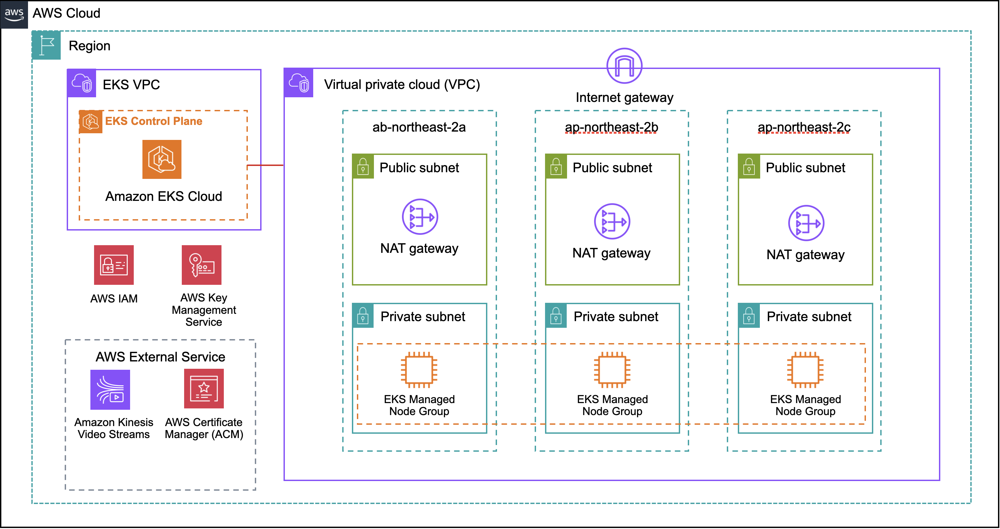
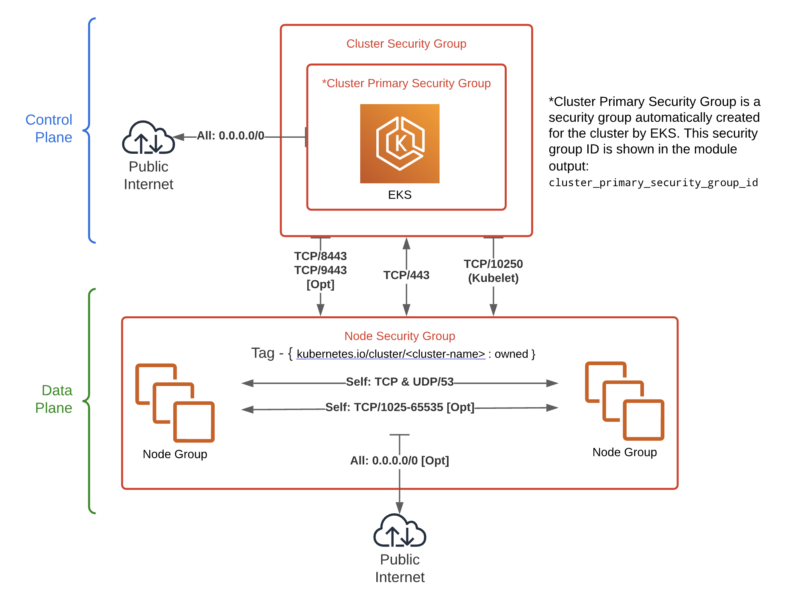
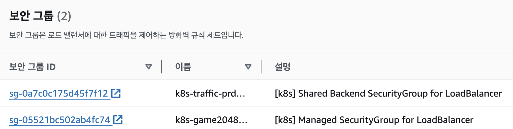

# EKS 설치 가이드

이 디렉토리의 구성은 Amazon EKS 관리형 노드 그룹을 사용하여 다양한 구성을 보여주는 Amazon EKS 클러스터를 생성합니다.

- `al2` demonstrates an EKS cluster using EKS managed node group that utilizes the EKS Amazon Linux 2 optimized AMI
- `al2023` demonstrates an EKS cluster using EKS managed node group that utilizes the EKS Amazon Linux 2023 optimized AMI (kubenetes 1.30 이상)

Amazon EKS 관리형 노드 그룹에 관련하여 [AWS documentation](https://docs.aws.amazon.com/eks/latest/userguide/managed-node-groups.html)에서 더욱 자세한 내용을 살펴볼 수 있습니다.



## Usage

아래와 같은 테라폼 명령어를 통해 Amazon EKS를 배포합니다.

```bash
$ terraform init
$ terraform plan
$ terraform apply --auto-approve
```

## Procedure

#### 1. 테라폼 tfstate 상태를 관리하기 위한 백엔드를 구성합니다.

각 환경(env)에 위치한 ./storage/tf_state/tf_state.tf 해당 경로에서 아래와 같이 테라폼을 실행합니다.

```bash
$ terraform init
$ terraform plan
$ terraform apply --auto-approve
```

---

해당 경로에서는 EKS 환경에 필요한 각 모듈의 상태를 관리하기 위한 S3 버킷과 상태 수정이 동시에 이루어질 수 없도록 Locking 작업을 위한 DynamoDB Table을 생성합니다.

#### 2. EKS 환경을 구축하기 위한 VPC, Subnet 등과 관련된 작업을 수행합니다.

각 환경(env)에 위치한 ./networking/vpc/vpc.tf 해당 경로에서 아래와 같이 테라폼을 실행합니다.

```bash
$ terraform init
$ terraform plan
$ terraform apply --auto-approve
```

---

#### 3. Amazon EKS 설치와 EKS 관리를 위한 기본 Add-ons를 설치합니다.

각 환경(env)에 위치한 ./main.tf 해당 경로에서 아래와 같이 테라폼을 실행합니다.

main.tf 파일에서는 위에서 언급한 사전에 필요한 작업이 다시 한 번 정의되어져 있습니다. 해당 파일에서 정의된 vars 모듈은 해당 경로 밖 하위 모듈에서 공통으로 사용할 변수를 선언해놓은 모듈입니다. 환경별로 값을 바꾸어 설치하시기를 바랍니다.

\*\* kubenetes 1.30 이상에서는 ./eks-install/modules/eks/eks.tf에서 설정한 linux2를 지원하지 않을 수 있습니다. eks 1.30 이상 부터는 기본값으로 linux3를 지원합니다. 따라서 eks 1.30 이상으로 설치 및 업그레이드 시에는 많은 부분을 재확인하여 설치해야하며, 일부 kubenetes add-ons도 작동되지 않을 수 있으므로 검토 후 적용하기를 바랍니다.

```bash
$ terraform init
$ terraform plan
$ terraform apply --auto-approve
```

---

#### 4. Amazon EKS를 조금 더 유용허개 관리하기 위한 Kubenetes Add-ons를 설치합니다.

각 환경(env)에 위치한 ./k8s_addons/k8s_addons.tf 해당 경로에서 아래와 같이 테라폼을 실행합니다. kubenetes add-ons와 관련된 리소스는 k8s-utils에 Helm 차트의 valus.yaml 등을 관리하고 있으며, 수정이 필요한 경우 해당 리소스를 참조하시기 바랍니다.

kubenetes add-ons는 자주 변경될 수 있는 사항으로 상태를 별도로 관리하기 위해 main.tf에서 관리하고 있지 않습니다.

```bash
$ terraform init
$ terraform plan
$ terraform apply --auto-approve
```

다음은 현재 사용중인 kubenetes add-ons입니다. Helm Chart의 버전은 변경될 수 있습니다.

|         k8s addons          | version |
| :-------------------------: | :-----: |
|        External DNS         | 1.14.5  |
| AWS LoadBalancer Controller |  1.8.1  |
|       EFS CSI Driver        |  3.0.6  |
|          Karpenter          | 0.37.0  |
|            KEDA             | 2.14.0  |
|        Strimzi Kafka        |   3.6   |
|    Nvidia Device Plugin     | 0.15.0  |
|       Metrics Server        | 3.12.0  |
|          FluentBit          | 0.1.33  |
|   Kube Prommetheus Stack    | 58.3.1  |

AWS kubenetes addons와 관련하여 더 많은 정보는 [AWS Blueprints Addons](https://aws-ia.github.io/terraform-aws-eks-blueprints-addons/main/)에서 더욱 자세한 내용을 살펴볼 수 있습니다.

---

#### 5. Amazon EKS 관리형 노드 그룹을 원하는 타입, 스펙을 통해 배포합니다.

관리형 노드그룹의 경우 Karpenter와 달리 AMI 릴리스 버전을 수동으로 주기적으로 업데이트 할 필요가 있습니다.

#### ● Trouble Shooting

#### `expect exactly one securityGroup tagged with kubernetes.io/cluster/<NAME> ...`

```sh
expected exactly one securityGroup tagged with kubernetes.io/cluster/prd-eks-cluster for eni eni-0ba86d5bdcb312d80, got: [sg-0254281e95b14afd8 sg-0dd453bbba4f02fc8] (clusterName: prd-eks-cluster)
```



기본적으로, EKS는 클러스터를 생성할 때 `{ "kubernetes.io/cluster/<CLUSTER_NAME>" = "owned" }` 태그가 달린 기본 보안 그룹을 만듭니다. 해당 태그를 가진 기본 보안 그룹과 모듈에서 생성된 노드 보안 그룹을 동시에 연결하려고 하면 문제가 발생합니다. 따라서, 동일한 클러스터의 노드에 이 태그가 달린 여러 보안 그룹이 연결되면 충돌이 발생할 것입니다.

이는 AWS Loadbanlancer Controller를 통해 생성되는 Backend Security Group이 `"kubernetes.io/cluster/<CLUSTER_NAME>" = "owned"` 해당 태그가 달린 Security Group에 추가 및 업데이트가 되지 않는 문제를 초래할 수 있습니다.

기본적으로 LBC는 ELB를 생성할 때 두가지의 보안그룹을 생성합니다.



`프론트엔드 시큐리티 그룹`: 로드 밸런서에 액세스할 수 있는 클라이언트를 결정합니다. 즉, 어떤 클라이언트를 연결할 수 있는지 지정하여 로드 밸런서에 대한 액세스를 제어로 클러스터 서비스에 대한 무단 액세스를 방지하고 예상치 못한 아웃바운드 연결을 차단하여 보안이 향상시킬 수 있더는 장점을 가집니다.

```yaml
# Ingress 리소스의 경우
alb.ingress.kubernetes.io/security-groups

# 서비스 리소스의 경우
service.beta.kubernetes.io/aws-load-balancer-security-groups
```

`백엔드 시큐리티 그룹`: 로드 밸런서와 대상 EC2 인스턴스 또는 ENI 간의 트래픽을 제어의 역할을 하므로 로드 밸런서가 노드에서 액세스할 수 있는 포트를 제한할 수 있습니다.

```yaml
# --enable-backend-security-group
name: k8s-traffic-<cluster_name>-<hash_of_cluster_name>
tags:
    elbv2.k8s.aws/cluster: <cluster_name>
    elbv2.k8s.aws/resource: backend-sg

# Ingress 리소스의 경우
alb.ingress.kubernetes.io/manage-backend-security-group-rules

# 서비스 리소스의 경우
service.beta.kubernetes.io/aws-load-balancer-manage-backend-security-group-rules
```

따라서 아래와 같이 현재 노드 보안그룹과 EKS 생성시 자동으로 만들어지는 클러스터 보안 그룹 모두가 EKS 관리형 노드 그룹에 보안에 할당되는 것이 문제이므로, 관리형 노드그룹의 보안 설정은 노드 보안 그룹으로만 설정합니다.

```sh
# EKS Managed Node Group
# Path: modules/managed_node
module "eks_managed_node_group" {
  source = "terraform-aws-modules/eks/aws//modules/eks-managed-node-group"

  use_name_prefix      = false
  name                 = var.node_group_name
  cluster_name         = var.eks_cluster_name
  cluster_version      = var.cluster_version
  cluster_service_cidr = var.cluster_vpc_cidr

  subnet_ids                        = data.aws_subnets.private_subnets.ids
  # 노드 보안 그룹만 추가
  vpc_security_group_ids            = [data.aws_security_group.node_group.id]
  # 클러스터 보안 그룹 제거
  # cluster_primary_security_group_id = data.aws_eks_cluster.cluster.vpc_config[0].cluster_security_group_id

  iam_role_additional_policies = var.iam_role_additional_policies

  ami_type = var.ami_type

  block_device_mappings = {
    xvda = {
      device_name = "/dev/xvda"
      ebs = {
        volume_size          = var.block_device_volume_size
        volume_type          = var.block_device_volume_type
        iops                 = var.block_device_iops
        throughput           = var.block_device_throughput
        delete_on_termination = true
      }
    }
  }

  min_size       = var.min_size
  max_size       = var.max_size
  desired_size   = var.desired_size

  instance_types = var.instance_types
  capacity_type  = var.capacity_type

  labels         = var.labels
  taints         = var.taints

  tags = var.tags
}
```

변경 후, 80 포트를 가진 인그레스를 배포하면 다음과 같이 노드 보안 그룹에 해당 포트에 관한 설정이 추가 및 업데이트 됩니다. 추가적으로 3000 포트를 가진 서비스를 배포 후, 인그레스를 설정한다면, LBC는 자동으로 포트 범위를 80-3000으로 변경해줍니다. 이렇게 설정됨에 따라 ALB가 노드 내에 있는 파드로 정상적으로 라우팅을 시킬 수 있습니다. Bad GateWay 등의 문제가 발생한다면 이 부분을 참조하세요.


#### k delete ns {specific namespace} > deleting.. (Not Complete)

네임스페이스에 리소스가 전혀 없음에도 불구하고 정상적으로 지워지지 않고, 계속해서 terminating 상태로 남아 있는 경우가 있다.
해당 경우 지정된 네임스페이스의 finalizers 필드를 빈 배열로 설정하여 강제로 삭제를 완료 처리를 할 수 있다.

```sh
k get ns {Namespace} -o json \
  | jq '.spec.finalizers=[]' \
  | k replace --raw /api/v1/namespaces/{Namespace}/finalize -f -
```
