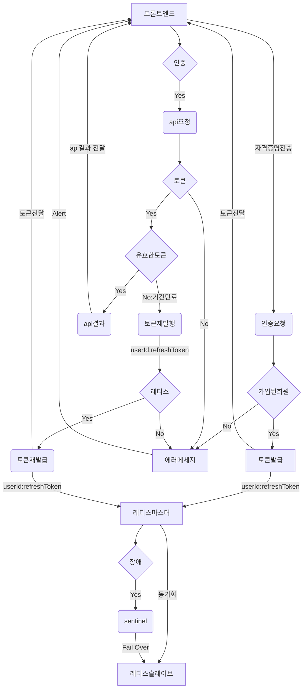

### 로그인 Flow 흐름

다음 순서도는 사용자 인증, 토큰 확인, 확인 성공 시 또는 오류 또는 만료 시 취해지는 조치를 처리하는 구성 flow를 나타냅니다.

여기에는 사용자 토큰 상태에 따른 조건부 단계와 필요에 따라 토큰을 갱신하거나
재발급하는 작업이 포함되며, 세션 또는 토큰 정보를 저장하기 위해 Redis를 사용하는 저장 메커니즘도 포함합니다.

1. 프로토타입(프로토타입): 프로세스의 시작점이라고 할 수 있습니다.
2. 자격증명 확인(자격증명 검증): 시스템에서 사용자의 자격 증명을 확인합니다.
3. API호출 (API 호출): 자격 증명이 유효한 경우 API 호출로 이어집니다.
4. 알림: API 호출에 문제가 있는 경우 알림 또는 경고가 트리거될 수 있습니다.
5. 토큰검증(토큰 확인): 자격 증명이 유효한 경우 토큰의 진위 여부를 확인합니다.
6. 토큰갱신 (토큰 갱신): 등록된 사용자의 경우 토큰을 갱신합니다.
7. userid:refreshToken -> 레디스 (userid:refreshToken -> 레디스): 사용자 아이디와 refreshToken이 Redis에 저장됩니다.
8. 레디스 슬레이브 (레디스 슬레이브): 시스템은 또한 이중화 또는 복제 설정의 일부인 Redis 슬레이브에 데이터를 저장합니다. (슬레이브는 여러대로 구성할 수 있습니다)
9. 기간만료 (만료): 토큰이 유효하지 않은 경우 토큰이 만료되었는지 확인합니다.
10. 토큰재발급(토큰 재발급): 토큰이 만료된 경우 새 토큰을 발급합니다.
11. 레디스 센티넬 (레디스 센티넬): Redis Master에 장애가 발생하면 Redis Sentinel이 이를 대신합니다. 이는 Redis에 고가용성을 제공하는 시스템입니다.
12. 페일오버: Sentinel 시스템이 장애를 감지하면 복제본으로 페일오버를 시작합니다.
