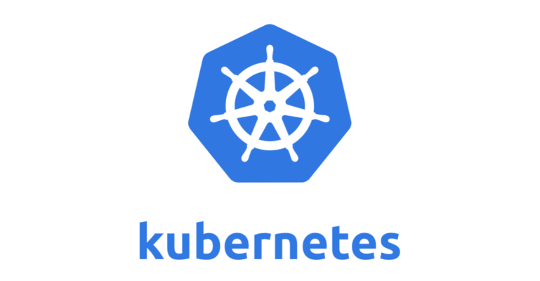

## Kubenetes 소개

by Yuchan Kim, Devops Engineer

---



### **Control Plane Component**

---

`kube-apiserver``
• kube-apiserver는 Kubernetes의 API를 노출하는 컴포넌트로 Kuberentes에 전달되는 모든 요청은 kube-apiserver를 통해 구현.

`etcd`

• etcd는 키-값(key-value) 저장소로, Kubernetes는 etcd를 기본 저장소로 사용하고 있으며 클러스터의 모든 정보를 저장.

• 모든 etcd 데이터는 etcd db 파일에 보관 → /var/lib/etcd

• master(controle plane) 장애 → etcd DB 데이터 유실에 대비하여 backup이 필요. (snapshot)

```bash
etcdctl snapshot ~
```

---

`kube-scheduler`

노드가 배정되지 않은 새로 생성된 Pod 생성 요청이 발생하면 이를 감지하고 어느 노드에 배정할지 결정하는 역할을 수행하는 컴포넌트.

---

`kube-controller-manager`

[컨트롤러](https://kubernetes.io/ko/docs/concepts/architecture/controller/) 프로세스를 실행하는 컨트롤 플레인 컴포넌트.

---

`cloud-controller-manager`

### **Data Plane (Node) Component**

---

`kubelet`

클러스터의 각 노드에서 실행되는 Agent로 Kubelet으로 전달된 파드 스펙(PodSpec)대로 컨테이너가 잘 동작하도록 관리하며, Kubelet은 쿠버네티스를 통해 생성되지 않는 컨테이너는 관리하지 않음.

---`

`kube-proxy`

서비스 정의를 네트워크 규칙으로 변환/관리를 담당하는 Kuberentes 도구로 클러스터의 각 노드에서 실행되는 네트워크 프록시(Proxy)로 **서비스(Service → Stable IP)**와 **파드(Pod → Unstable IP)** 간의 네트워크 연결을 유지하는 역할

• kube proxy는 addon 컴포넌트 중 하나인 CNI(Container Network Interface)와 밀접하게 연관되어 함께 작동하여 클러스터 내의 효율적이고 유연한 네트워킹을 지원

- **kube-proxy** : 네트워크 상에서 서비스의 가용성과 접근성을 관리
- **CNI (e.g. Amazon VPC CNI, Calico, Cilium)** : 컨테이너와 Pod의 네트워크 연결을 구성하는 기본적인 작업을 관리

→ 즉, 서비스 추상화를 제공하여, 여러 Pod로 구성된 서비스에 대한 네트워크 액세스를 관리하므로 외부에서 서비스로 들어오는 요청을 적절한 Pod로 전달

** More **

**kube-proxy**는 API 서버를 통해 서비스(Service) 오브젝트와 Endpoint 간의 모든 변화를 전달받아, 서비스 오브젝트의 안정적인 IP와 파드의 IP 및 포트를 매핑. 이는 서비스(Service) 오브젝트의 Label Selector와 일치하는 Label을 가진 모든 파드(Pod)의 엔드포인트 IP(Cluster IP)를 결합을 의미함.

API 서버가 이처럼 매핑된 서비스와 파드의 변경된 구성을 각 노드에 있는 kube-proxy로 전달하여 이를 반영함.

추가적으로 kube-proxy는 다양한 모드로 운영될 수 있으며 각각의 모드는 NAT 규칙을 구현하는 접근 방식이 상이함

- Iptables
- IPVS
- KernelSpace
- Userspace

따라서 **kube-proxy**는 \*\*\*\*그 자체로 트래픽을 처리하거나 로드밸런싱하지는 않지만, 클러스터 내의 각 노드에서 실행되며, IP 주소와 포트 번호를 사용하여 서비스를 Pod에 매핑하는 네트워크 규칙을 유지 관리함. 이는 iptables, ipvs 등 proxy mode 기반의 라우팅을 통해 이루어질 수 있으며, kube-proxy는 서비스 요청을 받으면, 이를 로드 밸런싱하여 후방의 여러 Pod 중 하나로 전달하는 역할을 담당

---

`container runtime`

• Kubernetes 클러스터의 **CRI**(Container Runtime Interface : Kubelet이 다양한 컨테이너 런타임을 사용할 수 있게 해주는 플러그인 인터페이스) 표준을 구현하는 모든 컨테이너 런타임과 상호 작용하도록 설계되어 있으므로, 파드가 노드에서 실행될 수 있도록 클러스터의 각 노드에 [컨테이너 런타임](https://kubernetes.io/ko/docs/setup/production-environment/container-runtimes/)을 설치하는 것은 필수

- [containerd](https://kubernetes.io/ko/docs/setup/production-environment/container-runtimes/#containerd)
- [CRI-O](https://kubernetes.io/ko/docs/setup/production-environment/container-runtimes/#cri-o)
- [Docker](https://kubernetes.io/ko/docs/setup/production-environment/container-runtimes/#docker)
- [미란티스 컨테이너 런타임(MCR)](https://kubernetes.io/ko/docs/setup/production-environment/container-runtimes/#mcr)

```bash
# AWS EKS version 1.28
k get node -o=custom-columns=NAME:.metadata.name,CONTAINER-RUNTIME:.status.nodeInfo.containerRuntimeVersion

NAME CONTAINER-RUNTIME
ip-10-110-12-129.ap-northeast-2.compute.internal containerd://1.7.11
ip-10-110-27-35.ap-northeast-2.compute.internal containerd://1.7.11
ip-10-110-30-42.ap-northeast-2.compute.internal containerd://1.7.11
ip-10-110-33-21.ap-northeast-2.compute.internal containerd://1.7.11
ip-10-110-34-136.ap-northeast-2.compute.internal containerd://1.7.11
ip-10-110-7-68.ap-northeast-2.compute.internal containerd://1.7.11
```
